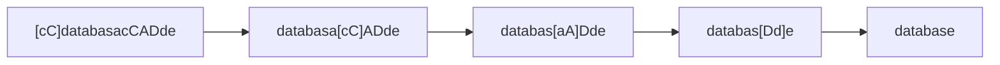

# Buggy Data Base
Mid term project for Programming Foundations
## Introduction
This project consists on creating functions that allow the completion of five independent tasks, to identify and correct the problems with a database (Buggy Data Base, BDB) that got corrupted for unknown reasons.

BDB contains authentication information of the users of a system and is wrongfully denying access to some of the registered users.

The tasks consist in:

 1. Documentation correction
 2. PIN discovery
 3. Data verification
 4. Content decryption
 5. Password depuration

## Documentation Correction
### Problem description
The first step to fix the problems with BDB is to study the given documentation. It is also corrupted but some text alteration patterns were detected that can be reverted.

The first pattern affects the words from the text individually: a letter outbreak formed by pairs of the same upper/lower case letter that were repeatedly inserted in the words. To recover each word, fixing the outbreak is needed. For that, when a upper/lower case pair of the same letter are adjacent to each other, they react by disappearing.

 - In `aA`, `a` and `A` react, leaving the characters string empty
 - In `aBbA`, `Bb` deleted itself, leaving `aA` that, as above, reacts not leaving anything
 - In `abAB` there are no two adjacent letters compatible, so, nothing happens
 - In `aabAAB`, even though 
`aa` and `AA` represent a pair of the same letter, but since are both upper/lower case, nothing happens
In `cCdatabasacCADde`, the following reaction sequence is executed:

After fixing the letter outbreak, there's a second error pattern: words appear with non sense in the text that correspond to anagrams of the previous words. For each new word, detecting and deleting anagrams (different from itself) that appear in the rest of the text is needed.
### Work to do
#### fix_word
This function receives a string that represents a word (possibly with the letter outbreak) and returns the string that corresponds to the application of the reaction sequence as described to correct the word.
#### is_anagram
This function receives two strings corresponding to two words and returns True if, and only if, one of them is anagram of the other one. This is, if the words have the same letters, ignoring upper/lower casing and the order of the characters.
#### fix_doc
This function receives a string of characters that represents the text with the documentation errors of the BDB and returns the chain of characters filtered with the words fixed and the anagrams removed.
### Examples
```
>>>  fix_word("abBAx")
"x"
>>>  fix_word("cCdatabasacCADde")
"database"
>>>  is_anagram("caso", "SaCo")
True
>>>  is_anagram("caso", "casos")
False
>>>  fix_doc("???")
ValueError: fix_doc: argumento invalido
>>> doc =  "BuAaXOoxiIKoOkggyrFfhHXxR duJjUTtaCcmMtaAGga \
eEMmtxXOjUuJQqQHhqoada JlLjbaoOsuUeYy cChgGvValLCwMmWBbclLsNn \
LyYlMmwmMrRrongTtoOkyYcCK daRfFKkLlhHrtZKqQkkvVKza"
>>>  fix_doc(doc)
"Buggy data base has wrong data"
```

## PIN Discovery
### Problem Description
For this, we get a PIN codified as a tuple of strings with movements. In order to get the PIN, we should press a number and find the next number through the moves sequence provided. "U" moves up, "D" moves down, "L" moves left and "R" moves right. Each line of instructions corresponds to a number, starting at the previous number (or 5, if it's the first line). The button to press is the one at the end of each line. If a move doesn't end up in a button, then it is ignored.
### Work to do
#### get_digit
#### get_position
#### get_pin
### Examples

## Data Verification
### Problem Description
### Work to do
#### is_entry
#### validate_cipher
#### filter_bdb
### Examples

## Data Decryption
### Problem Description
### Work to do
#### grab_security_number
#### decipher_text
#### decipher_bdb
### Examples

## Password Depuration
### Problem Description
### Work to do
#### is_user
#### is_valid_password
#### filter_passwords
### Examples
